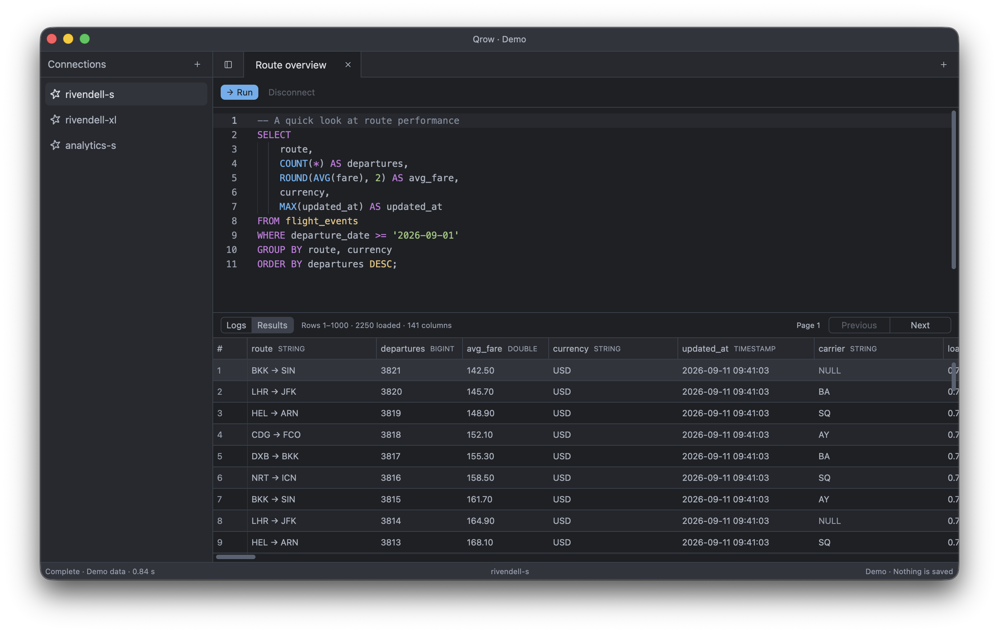
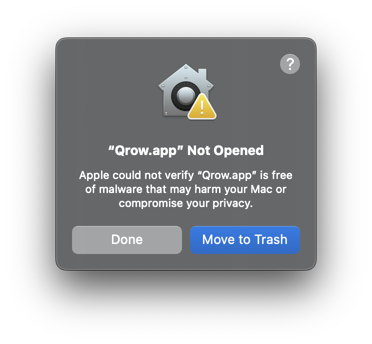
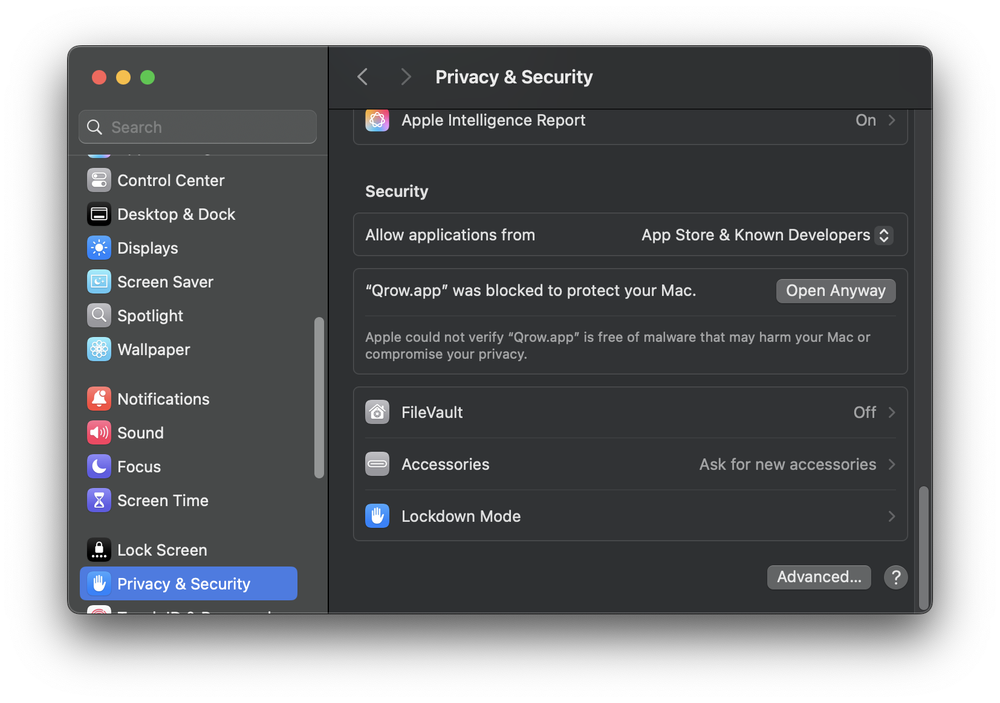

<p align="center">
    
</p>

# Qrow

A native (no JVM, no Electron) SQL workbench for macOS. Built with Rust using [GPUI](https://gpui.rs/) and [GPUI Kit](https://github.com/longbridge/gpui-kit).



## Why

I'm a data engineer. I run SQL every day, and for years my tool of choice was
[DataGrip](https://www.jetbrains.com/datagrip/). It worked well until it didn't: slow startup times, a heavy memory
footprint, regular freezing, and all the usual quirks that come from running on the JVM.
I went looking for an alternative and found none suited to me.

Building a whole new SQL client from scratch on top of a
full-time job wasn't realistic for me — until AI models got good enough, that is.

I'm not a Rust developer, so practically every line of code here is written by one
model or the other. I bring in my direction, general coding expertise, and user sense. 

## Inspiration

Qrow is heavily inspired by DataGrip and [Zed](https://zed.dev/). It's built using [GPUI](https://gpui.rs/), which is a UI framework by Zed's creators.

## Optional AI assistant

Qrow can open an AI assistant beside your query tab. It uses a separately
installed Codex program and your Codex sign-in. The feature is off by default.
Enable it in **Qrow → Settings… → AI Assistant**. Qrow can ask before an assistant
query runs, or run assistant queries automatically. The assistant writes SQL in
the selected tab, so you can work on it together. See [AI assistant](docs/assistant.md)
for setup, data sharing, and query safety.

## Metrics

Measured on MacBook Air M3 (macOS 15.7.7).

| Metric | Qrow | DataGrip 2026.2.5 |
| --- | ---: | ---: |
| Time to first window | 0.52 s | 1.84 s |
| Idle memory usage | 152 MB | 1,302 MB |
| App size on disk | 27 MB | 2.6 GB |

## Limitations

Qrow is a personal tool, tailored to my setup and my needs, so:

- **Kyuubi/Spark only.** The only connector implemented is HiveServer2 over
  SASL PLAIN, matching the deployment I connect to daily. Trino, Postgres and DuckDB are planned.
- **Apple Silicon macOS only.** That's the hardware I run every day; there's
  no Intel or other-OS build.
- **Core functionality first.** 90% percent of the work I do in such an app is choosing a connection, writing a query, running it, and seeing results. That is what Qrow is focused on.
- **Not notarized**. Certification and notarization of macOS apps requires Apple Developer ID which is a paid membership. As Qrow is a mostly a personal tool that is early in development, I'm not planning to pay for that membership yet. For now, releases are distributed through a custom Homebrew tap, and macOS may show a Gatekeeper warning on first launch.

## Installation

### Homebrew

Qrow is available from the custom [Homebrew tap](https://github.com/vsevolodbazhan/homebrew-qrow):

```sh
brew tap vsevolodbazhan/qrow
brew install --cask vsevolodbazhan/qrow/qrow
```

To install the latest nightly build, use the separate cask:

```sh
brew install --cask vsevolodbazhan/qrow/qrow@nightly
```

### GitHub Releases

Alternatively, head over to the [GH releases page](https://github.com/vsevolodbazhan/qrow/releases), download the DMG, and drag it to Applications.

## Gatekeeper



The current release package uses ad hoc code signing. Homebrew can install the
custom cask, but macOS Gatekeeper may warn until the app is signed and notarized
with Apple Developer ID. To bypass the Gatekeeper:

1. Open the app. You'll see the warning.
2. Head over to "Settings", open "Privacy & Security", click "Open Anyway".



## Build

### Prerequisites

- A current stable Rust toolchain, including `cargo` and `rustc`.
- Xcode command-line tools. Install them with `xcode-select --install` if needed.
- [uv](https://docs.astral.sh/uv/), which provisions the pinned Python 3.11+
  toolchain used by the packaging, dependency-license, and code-generation
  scripts. A separately installed Python is not required.

Check your tools:

```sh
rustc --version
cargo --version
xcode-select -p
uv --version
```

Java, ODBC drivers, and the Thrift compiler are not required to build or run Qrow. GPUI is built with runtime Metal
shader compilation, so the separate Xcode Metal compiler is not required either.

### Debug

For development, compile and launch the debug build in one command:

```sh
cargo run --locked --bin qrow
```

To build an optimized executable without creating an app bundle:

```sh
cargo build --locked --release --bin qrow
./target/release/qrow
```

Use the release build when checking startup time and responsiveness. Running
the executable from a terminal also shows startup timing and diagnostic output.

### Release

For normal use, build the optimized application bundle and launch it:

```sh
sh scripts/package/macos.sh
open dist/Qrow.app
```
The script builds for the current Mac's architecture and produces `dist/Qrow.app`
and `dist/Qrow-macos.zip`. 

You can also double-click `dist/Qrow.app` in Finder or copy it to Applications.
After changing the source, quit Qrow, rerun the packaging script, and reopen the
app. The packaged app does not update automatically when you run `cargo build`.

## Preview

Launch the demo to inspect syntax highlighting, tabs, and a populated results
table. It does not connect to a server, access Keychain, or change the saved
workspace:

```sh
cargo run --locked --bin qrow -- --demo
```

Or, after building the release executable:

```sh
./target/release/qrow --demo
```

## Documentation

See the [documentation index](docs/README.md) for application behavior,
architecture, development, and end-to-end testing.

## Contributions

Issues and discussion are welcome, but the project isn't set up for external pull requests right now.
You are free to fork it, though.

## License

Qrow uses the [MIT License](LICENSE).
Third-party code retains its original licenses. See [NOTICE](NOTICE).
