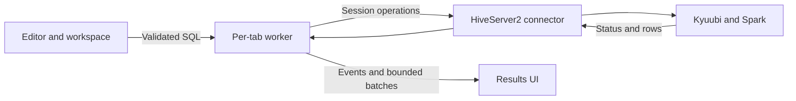

# Architecture

The application connects directly to Kyuubi through HiveServer2 Thrift. It does
not need a local JVM, webview, or separately installed database driver. Java in
the [end-to-end tests](end-to-end-testing.md) belongs to the server fixture.

## Main components

| Component | Responsibility |
| --- | --- |
| [Application and UI](../src/main.rs) | Initialize GPUI Kit, assets, the SQL language, and the root view. |
| [Workspace controller](../src/ui.rs) | Coordinate tabs, editor state, worker events, and commands. |
| [UI modules](../src/ui/) | Present workspace layout, forms, settings, and results. |
| [Worker](../src/worker.rs) | Own a tab's session and coordinate execution, cancellation, and fetching. |
| [Connector boundary](../src/connector/mod.rs) | Define session operations independently of the UI. |
| [HiveServer2 connector](../src/connector/hive.rs) | Implement authentication, session work, and result decoding for Kyuubi. |
| [Storage](../src/storage.rs) | Save the workspace and access macOS Keychain. |

The [core library](../src/lib.rs) builds without the `ui` feature. UI code belongs
to the application binary. This separation permits headless core tests and keeps
connector behavior independent of editor controls.

## Query data flow

The UI reads the selection and validates statement boundaries. The worker opens
a session when needed, runs the SQL, and fetches a bounded preview. Worker events
wake the UI to update status and results.

Each tab owns one session and can perform one active query. Tabs can work
concurrently. [Connections](connections.md), [Queries](queries.md), and
[Results](results.md) describe the behavior and its constraints.

## Responsiveness and state

Network calls and Keychain access run on background threads. Workspace writes
use a background saver. Idle UI work waits for notifications. Temporary timers
handle pending saves and forms; active server operations have their own status
checks. There is no continuous idle repaint loop.

Result rendering virtualizes both dimensions. Stored values remain separate
from shortened cell previews. Restoring the workspace does not restore sessions
or results, so database connections do not delay startup.

The window shell owns overlays separately from workspace state. Table behavior
stays in the results module. Focused form modules keep presentation and validation
out of the root render method.

## Connector and framework boundaries

The connector interface covers session lifecycle, execution, status, cancellation,
and batched results. Only HiveServer2 is implemented. Another connector should
use this boundary without changing editor behavior. Qrow has no dynamic driver
plugin system.

Cancellation uses a separate authenticated transport because the query transport
can block during fetching. SQL is never automatically retried after a transport
failure because the statement can already have changed data.

GPUI Kit supplies a compatible framework, component, asset, and platform set.
Upgrade these dependencies together. Runtime Metal shader compilation permits
builds with Xcode command-line tools. Initialize the framework, assets, SQL
language registry, and root view before using editor controls.

Generated Thrift bindings are checked in. Their maintenance and regeneration
procedure belongs in [Development](development.md#generated-bindings).
