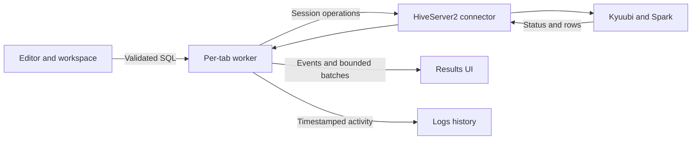

# Architecture

The application connects directly to Kyuubi through HiveServer2 Thrift. It does
not need a local JVM, webview, or separately installed database driver. Java in
the [end-to-end tests](testing.md#run-the-servers) belongs to the server fixture.

## Main components

| Component | Responsibility |
| --- | --- |
| [Application](../src/main.rs) | Select the user or demo environment and open the window. |
| [UI entry points](../src/ui.rs) | Initialize GPUI Kit, themes, the SQL language, key bindings, and menus. Wrap the root view. |
| [UI environment](../src/ui/environment.rs) | Select the workspace file and the password store of a window. |
| [Workspace controller](../src/ui.rs) | Coordinate tabs, editor state, worker events, activity history, and commands. |
| [UI modules](../src/ui/) | Present workspace layout, forms, settings, results, and Logs history. |
| [Activity model](../src/activity.rs) | Group activity entries, apply retention, and define panel transitions. |
| [Worker](../src/worker.rs) | Own a tab's session and coordinate execution, cancellation, and fetching. |
| [Connector boundary](../src/connector/mod.rs) | Define session operations independently of the UI. |
| [HiveServer2 connector](../src/connector/hive.rs) | Implement authentication, session work, and result decoding for Kyuubi. |
| [Response protocol](../src/connector/protocol.rs) | Bound response bytes and allocation before Thrift decoding. |
| [Storage](../src/storage.rs) | Lock and save the workspace. Define the password store and its macOS Keychain implementation. |

The [core library](../src/lib.rs) builds without the `ui` feature. The UI
modules are in the same library behind the `ui` feature, and the application
binary only opens the window. This separation permits headless core tests and
keeps connector behavior independent of editor controls. UI integration tests
use the library to open the real window with a temporary workspace and
synthetic passwords.

## Query data flow

```mermaid
flowchart LR
    Editor[Editor and workspace] -->|Validated SQL| Worker[Per-tab worker]
    Worker -->|Session operations| Connector[HiveServer2 connector]
    Connector --> Kyuubi[Kyuubi and Spark]
    Kyuubi -->|Status and rows| Connector
    Connector --> Worker
    Worker -->|Events and bounded batches| Results[Results UI]
    Worker -->|Timestamped activity| Activity[Logs history]
```

The UI reads the selection and validates statement boundaries. The workspace
groups tabs by their owning connection while the worker keeps one session per
tab. The worker opens a session when needed, runs the SQL, and fetches a bounded
preview. Worker events wake the UI to update status and results. Selecting a
connection changes the visible tab group and does not stop hidden workers.

The worker sends activity events through a separate channel. Activity events
carry a wall-clock timestamp, an execution ID, an event kind, and a measured
duration when available. The UI stores them in the tab's in-memory activity
model. It does not save them in the workspace.

Each tab owns one session and can perform one active query. Tabs can work
concurrently. [Connections](connections.md), [Queries](queries.md), and
[Results](results.md) describe the behavior and its constraints.

## Responsiveness and state

Network calls and Keychain access run on background threads. Workspace writes
use a background saver with exclusive workspace ownership. Quit and window
close wait for a save acknowledgement. [Workspace](workspace.md) describes
save recovery and the native termination limitation. Idle UI work waits for
notifications. Temporary timers
handle pending saves and forms; active server operations have their own status
checks. The caret of a focused text field blinks for 10 seconds after the last
input, focus, or window activation. Then the caret stays visible and does not
blink, because each blink repaints the window. There is no continuous idle
repaint loop.

The assistant worker thread owns the Codex process. Window commands and Codex
output arrive on one channel. The worker sleeps until a command or a Codex
message arrives. It does not poll while the assistant is idle. The window thread
does not wait for Codex. **Reconnect**, the **Enabled** setting, and the
[idle stop](assistant.md#pane-and-connection-state) stop Codex on a separate
thread. That thread kills the Codex process group if Codex does not stop in
1.5 seconds. Quit waits up to 2 seconds for these threads. The idle stop uses
one window timer, and it does not poll.

A window gets display refresh ticks only while GPUI requests frames. It stops
its display link 1 second after the last frame request, so an idle window does
not wake the main thread at the refresh rate of the display. See the
[macOS platform patch](../vendor/gpui-pre-macos/QROW-PATCH.md).

Result rendering virtualizes both dimensions. Stored values remain separate
from shortened cell previews. Restoring the workspace does not restore sessions
or results. It does not restore Logs history, so database connections do not
delay startup.

The window shell owns overlays separately from workspace state. Table behavior
stays in the results module. Focused form modules keep presentation and validation
out of the root render method.

## Connector and framework boundaries

The connector interface covers session lifecycle, execution, status, cancellation,
and batched results. Only HiveServer2 is implemented. Another connector should
use this boundary without changing editor behavior. Qrow has no dynamic driver
plugin system.

Cancellation uses a separate authenticated transport because the query transport
can block during fetching. SQL is never automatically retried after a transport
failure because the statement can already have changed data.

GPUI Kit supplies a compatible framework, component, asset, and platform set.
Upgrade these dependencies together. Runtime Metal shader compilation permits
builds with Xcode command-line tools. Initialize the framework, assets, SQL
language registry, and root view before using editor controls.

Generated Thrift bindings are checked in. Their maintenance and regeneration
procedure belongs in [Development](development.md#generated-bindings).
