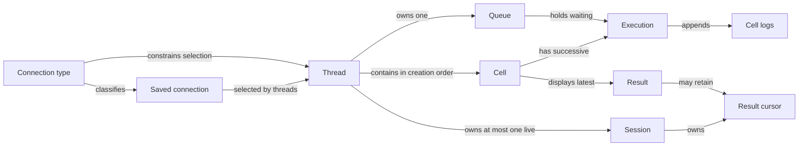

# Qrow threads and cells

This specification describes the first rebuild of Qrow around threads and SQL cells.
The product requirements record the confirmed interview decisions.
Separate sections identify retained behavior and proposed implementation defaults.
Those defaults fill details that were not separately confirmed in the interview.
This document describes future behavior. The application has not been changed.

## Purpose and everyday use

Organize SQL work into threads. Each thread contains SQL cells.
Run cells independently and inspect the output below each cell.
Keep related SQL together without query tabs.

Qrow has one user and no public releases at this time.
The redesign can replace the existing application model.
The new SQLite workspace starts empty. Existing workspace files remain untouched.

## Implementation scope

Keep the native Rust and GPUI stack.
Reuse existing editor and connector code where it supports this design.
Replace the tab model with threads and cells.
Add a separate execution queue for each thread.
Support multiple cell result cursors in each thread's session.
Move persistent application data to SQLite.
Remove the existing end-to-end tests during the first rebuild.
Implement new end-to-end tests later, after the UI and functionality are stable.
Stable means the user has tested the rebuilt UI and functionality and explicitly confirmed the behavior.
Do not start end-to-end test implementation before that confirmation.

## Layout requirements

- Put threads in the left sidebar.
- Put cells in the main thread area.
- Put connections and their status indicators in the right sidebar.
- Let the user independently hide and show the left and right sidebars.
- Let the user hide both sidebars so the thread fills the window.
- Keep each sidebar's toggle available when that sidebar is hidden.
- Let the user resize each sidebar by dragging its edge.
- Share sidebar widths and visibility across threads.
- Restore sidebar widths and visibility after application restart.
- Provide actions to create, edit, and manage connections.
- Give each cell its own output panel.
- Show output inline by default.
- Let the user maximize an output panel within the thread viewport.

The wireframe and written notes establish the sidebar positions.

## Output panels

Let the user resize the height of each inline output panel independently.
Scroll large tables and logs within their output panel.
Use the main thread scroll to move between cells.
Adding result rows does not continually increase the panel's height.
Maximizing an output panel fills the central thread area.

Let the user collapse each cell's output independently.
Keep the cell's SQL visible when its output is collapsed.
Show a compact summary with the run status, downloaded row count, and duration where applicable.
Collapsing output preserves the cell's results, logs, and result cursor.
Running or finishing a cell does not change whether its output is collapsed.
Keep collapsed output collapsed when execution fails.
Update the compact summary with progress or an error.
Make error details available when the user expands the output.
Execution does not move keyboard focus or change the thread's scroll position.
Automatically select a cell's Logs view when that cell reports an error.
Automatically select its Results view when execution succeeds.
Apply this selection to the affected cell only, including cells in background threads.
Do not select another thread or expand a collapsed output panel when its view changes.
Save each cell's output height and collapsed state.
Restore these preferences when switching threads and after application restart.
Restoring these preferences does not restore results or logs.

## Domain glossary

| Term | Meaning |
| --- | --- |
| Thread | A saved sequence of cells with an optional selected connection. A thread owns its execution queue and live session. |
| Cell | An SQL editor in the thread's fixed creation order. A cell displays its latest result and logs from its executions. |
| Connection | Saved settings used to establish a session. Multiple threads can use the same connection. |
| Connection type | The connection category used to limit which connections a thread can select. The only initial type is Spark (HiveServer2). |
| Session | The live database session owned by one thread. Cells in that thread share session state. |
| Execution | One submitted SQL snapshot and its outcome. The snapshot is captured when the user presses Run. |
| Queue | The ordered executions waiting to run in one thread. |
| Result | The latest execution's columns, downloaded rows, and completion status. Earlier result tables are not retained. |
| Result cursor | A server operation used to fetch more rows from one execution. It requires the original session. |
| Log entry | An activity message associated with a cell execution or a connection's session activity. |
| Panel | A presentation area for a cell's results or execution logs. It can appear inline or fill the thread viewport. |

Current, Open, and Closed are the requested thread categories.
Current identifies the selected thread. Open identifies another visible thread.
Closed identifies a thread hidden in the Closed section.
Closed threads can be reopened.

Implementation default: store selection separately from open or closed state.
At most one open thread is Current. No thread is Current when all threads are closed.

## Relationships

- A thread contains cells in creation order.
- A thread selects zero or one connection and retains its connection type.
- Multiple threads can select the same connection.
- A thread has at most one live session at a time.
- All cells in a thread use that thread's session.
- A thread owns one execution queue.
- An execution belongs to one cell.
- A cell has at most one queued or running execution.
- A cell displays one result table. It does not provide a history of result tables.
- A cell retains logs from successive executions.
- Lifecycle log entries identify the associated thread.



The diagram shows logical relationships, including objects held only in memory.
It does not require a database table for every object.

## Thread navigation

Keep the thread list in stable creation order, with newly created threads at the top.
Selecting a thread highlights its existing row.
Selection and background execution do not reorder the list.

Show activity indicators beside thread names.
Show a spinner while a thread opens a session, executes SQL, or fetches results.
Show the number of queued cells.
Show a paused badge when the execution queue is paused.
Make the pause reason available on hover.
These indicators do not change the Current, Open, and Closed categories.

Name new threads Thread 1, Thread 2, and so on.
Keep manual renaming available. Do not generate names from SQL.

Show closed threads in the collapsible Closed section.
Provide Delete permanently in that section.
Ask for confirmation before deleting a thread and all its cells.
Skip confirmation for an empty thread containing only unused, blank cells.
Closing remains reversible. Permanent deletion removes the saved thread content.

Provide search across thread names and cell SQL in both open and closed threads.
Selecting a match opens its thread and takes the user to the matching cell.

## Confirmed execution rules

1. Run submits the entire cell.
2. A cell can execute one SQL statement in the initial rebuild.
3. Run captures the SQL immediately. Later edits do not change that execution.
4. The user can edit a queued or running cell.
5. Run is unavailable for a cell that already has a queued or running execution.
6. To replace queued SQL, remove the queued execution and submit the cell again.
7. Each thread runs at most one cell execution at a time.
8. Different threads can run concurrently.
9. The user can submit cells in any order.
10. A failed execution pauses that thread's queue.
11. Remaining executions stay queued after a failure.
12. The user must explicitly resume a paused queue.
13. Fixing and rerunning the failed cell does not automatically resume the queue.
14. A failure in one thread does not pause other threads.
15. Cells remain in creation order. Manual reordering is out of scope for now.
16. Rerunning a cell does not change its position.
17. The Results panel does not provide access to earlier result tables.

Execution is per cell in the initial rebuild. Do not provide Run All.

## Queue interface

Run queued cells in submission order.
Show each waiting cell's queue position, such as Queued 1 or Queued 2.
Keep queue positions separate from execution markers.
Update the positions when the queue changes.
Provide an action on each queued cell to remove its pending execution.

Show the queued execution count in the thread header.
Put the Pause queue and Resume controls in the thread header.
Provide Clear queue to remove all pending executions.
Clear queue lets the current execution finish.

## Queue pause and recovery

Provide a manual Pause queue control.
Let the current execution finish, then hold the remaining executions until the user selects Resume.

Cancelling a running execution pauses the thread's queue.
Keep the remaining executions queued until the user explicitly resumes the queue.
Other threads continue normally.

Removing an execution that has not started only removes that queue item.
This action does not pause the queue.

When a thread's queue is paused, provide Run once for an eligible cell.
A cell is eligible when it has no queued or running execution.
Run once captures the cell's SQL and executes that snapshot.
The thread still permits only one running execution at a time.
Keep the rest of the queue paused after Run once, including after success.

The user can use Run once to retry an edited cell or run another setup cell.
Resume queue continues the remaining queued executions.

## Cell creation

A new thread starts with one empty SQL cell and focuses its editor.
The user explicitly adds each additional cell.
Add cell appends an empty cell at the bottom of the thread.
Running a cell does not create another cell.

Provide a Duplicate button on each cell.
Duplicate copies the cell's current SQL into a new cell at the bottom of the thread.
The duplicate starts at `[ ]`, with empty results and logs.

Block cell deletion while the cell has queued or active work.
Delete an unused, empty cell immediately.
Ask for confirmation before deleting a cell with SQL or execution history.
Deleting a cell removes its SQL, results, and logs.

## Keyboard interaction

Use normal editor interaction. Do not add a separate notebook command mode.

| Shortcut | Action |
| --- | --- |
| Cmd+Enter | Run or queue the focused cell. Submit its entire SQL text. |
| Cmd+Shift+Enter | Append an empty cell and focus its editor. |
| Cmd+T | Create a thread. |
| Cmd+W | Close the current thread, subject to its work restrictions. |
| Cmd+B | Hide or show the left Threads sidebar. |
| Cmd+Shift+B | Hide or show the right Connections sidebar. |

The new Cmd+B action replaces the current application's Connections sidebar binding.
Keep visible toggle buttons for both sidebars.

## Results across edits and executions

Editing a cell preserves its existing results.
Queuing a rerun also preserves the existing results until execution starts.
When the rerun starts, clear the previous results.
Display new results from the new execution.
A failed rerun clears the results. Previous results must not suggest that the rerun succeeded.
The execution error remains available in the cell's logs.

Show SQL changed since run when the editor SQL differs from the submitted SQL for its latest started execution.
Compare against the captured SQL, including edits made while that execution runs.
Keep the exact submitted SQL in the execution logs.
Remove the label when the editor SQL matches that execution's submitted SQL.
Do not show this label before the cell's first execution.

## Result fetching

Each cell keeps its own result cursor for its latest execution.
Running another cell does not prevent additional fetches for an earlier cell.
Additional fetches require the original session to remain connected.
After disconnection, downloaded pages remain available.
To fetch further rows after disconnection, the user must rerun that cell.

If another cell is running, a request for an undownloaded page waits.
After the running cell finishes, fetch the requested page before starting the next queued cell.
Browsing downloaded pages does not wait for running work.

Allow additional result fetches while the execution queue is paused.
Require the original session to remain connected and enough result memory to be available.
Wait for any active execution before fetching.
Keep the execution queue paused after the fetch finishes.
Downloaded pages remain immediately available while the queue is paused.

If fetching a later page fails, preserve downloaded pages from that execution.
Mark the result Incomplete results and record the error in the cell's logs.
This differs from a failed rerun, which clears the cell's results.

If the user cancels a result fetch, preserve downloaded rows.
Mark the result Incomplete: fetching cancelled and close its cursor.
Fetching additional rows then requires rerunning the cell.
Cancelling a fetch also pauses the thread's queue.

## Result memory and manual clearing

Use a shared memory budget for downloaded result rows.
Set the default budget to 256 MiB. Let the user change the budget in Settings.
The budget covers downloaded row data. Editors and logs use additional memory.
A cell can use the available shared budget.
Replace the previous individual preview limits of 100,000 rows and 64 MiB with this shared budget.
Retain paginated loading. Transport limits remain separate from the retained-result budget.
When the budget is reached, stop further fetching and keep existing results available.
Pause the affected thread's execution queue.
Show a memory-limit message. Do not present the limit as a query failure.
After clearing results, the user must explicitly resume the thread.
Do not automatically discard old results.
The user chooses which results to clear to free memory.
Clearing results removes all downloaded pages for the selected cell and closes its result cursor.
Preserve the cell's SQL, logs, and execution number.
Show Results cleared in its output panel.
The user must rerun the cell to get results again.

Provide Clear results on each cell.
Also provide a shared Manage results view for open and closed threads.
List each result's thread name, SQL preview, and approximate memory use.
Let the user select which results to clear.
Show current usage and the configured limit in Manage results.
Apply the same clearing behavior to selections in Manage results.

After the user frees memory and selects Resume, finish the interrupted page fetch before starting the next queued cell.
Continue the fetch with its existing result cursor.
Do not rerun the SQL to recover the requested page.
If the user cleared that cell's results, discard its pending fetch because its cursor is closed.
In that case, Resume continues with the remaining queued executions.
The original session must remain connected to continue an interrupted fetch.

## Execution markers

Put each cell's execution marker in the left gutter beside its SQL editor.

- Show `[ ]` when a cell has not executed.
- Assign an execution number when the execution starts.
- Count successful, failed, and cancelled executions.
- Do not assign a number to work removed from the queue before it starts.
- Show `[*]` while a cell runs.
- After execution, show the assigned number, such as `[3]`.
- Rerunning a cell replaces its previous execution number.

Example: cell A succeeds as `[1]`. Cell B fails as `[2]`.
Rerunning B gives B the number `[3]`.

## Connection type and new threads

The only connection type in the initial rebuild is **Spark (HiveServer2)**.
Use this exact display name in the interface.
Represent connection type explicitly in the data model.

A new thread inherits the current thread's selected connection.
The new thread has its own session. It does not share the current thread's session.
The user can change the inherited connection with the selector in the thread header.
If there is no current connection to inherit, create the thread without an assigned connection.
Show No connection in its header and disable Run until a connection is selected.
The user can edit SQL before assigning a connection.
This also applies when no connections have been configured yet.

## Session creation

Open a thread's session on its first Run.
Selecting a connection does not open a session.
Apply the same rule after switching connections or reopening a closed thread.

Retain the existing connection idle policies: disconnect after a configurable timeout,
or keep connected with periodic heartbeat SQL.
Apply the connection's policy independently to each thread's session.
Closing a thread always disconnects its session, regardless of the idle policy.

Postpone Qrow's idle disconnection while work remains queued, including when the queue is paused.
Start the idle timer once the queue is empty and active work has finished.

## Unexpected session loss

Pause the thread's queue when Qrow detects an unexpected loss of its session.
Show Session lost in the thread.
Preserve the queued SQL snapshots, cell SQL, and logs.
Keep downloaded results from previous executions.
For the interrupted operation, apply the failed-rerun or failed-fetch rules above.
Result cursors from the lost session are no longer available.

The next explicit run opens a new session.
The user can use Run once to recreate temporary views or session settings.
Reconnection and a successful Run once do not resume the remaining queue.
The user must explicitly select Resume to continue queued executions.
Never automatically replay earlier SQL to restore session state or recover an interrupted execution.

## Manual disconnection

Provide Disconnect session in the thread header.
This action affects only that thread.

Provide Disconnect all sessions in the connection menu.
This action affects all threads using that connection.

Block each action while an affected thread has queued or active work.
Preserve SQL, cell logs, downloaded results, and execution numbers after disconnection.
The next Run opens a new session.

## Connection indicators

Each connection has one color indicator that summarizes work across all threads.
Use two connected states and one disconnected state:

| State | Condition |
| --- | --- |
| In use | At least one thread is opening a session, executing SQL, or fetching results. |
| Connected, idle | At least one thread has a live session, and no thread is doing that work. |
| Disconnected | No thread has a live session, and no thread is opening one. |

In use takes precedence over Connected, idle.
Show counts across threads in a popup when the user hovers over the indicator.
Errors remain available in logs. There is no separate error state for the indicator.
Count a running heartbeat as In use.
Identify Keep-alive activity in the connection's hover details.
After the heartbeat finishes, recompute the status across all associated threads.
Record heartbeat activity in connection logs.
Heartbeats do not change cell execution numbers, results, or selected output views.

## Connection changes

An existing thread can select another connection of the same type.

Block connection changes while the thread has running or queued work.
A paused queue also blocks connection changes.
Previously submitted work must not move to another connection.

When the connection changes:

1. Keep the cells, their creation order, and SQL.
2. Clear cell results and execution numbers. Preserve all cell logs.
3. Show `[ ]` for every cell.
4. Reset numbering. The next execution receives `[1]`.
5. Release the thread's previous session.
6. Leave other threads and their sessions unchanged.

Record the connection change in the cell logs.
Identify the connection for each logged execution.

## Editing and deleting connections

Block changes to a connection's host, port, username, password, database, or session parameters
while any associated thread has running or queued work.
A paused queue also blocks these edits.
Renaming the connection and changing its idle policy remain available.

When the user changes those connection details, reset every associated thread,
including closed threads:

1. Release the thread's session.
2. Clear its results and reset execution markers to `[ ]`.
3. Reset numbering so the next execution receives `[1]`.
4. Preserve its cells, SQL, and all cell logs.
5. Open a new session on the next Run.

Renaming the connection or changing its idle policy does not reset threads.

Block connection deletion while any associated thread has running or queued work.
Deleting a connection leaves its threads intact and unassigns their connection.
Keep each thread's connection type.
Show No connection and disable Run until the user selects another connection of that type.
Use the connection-deletion default below for existing results and execution markers.

## Closing and reopening threads

Closing a thread moves the thread into the Closed section.
Closing releases its session and disconnects.
Reopening does not restore temporary views or other previous session state.

When the current thread closes, select the next open thread in the sidebar's stable order.
If no open thread follows it, select the previous open thread.
If no threads remain open, show an empty main area with a New thread button.
Keep closed threads available in the Closed section.
Do not automatically create a thread when the last open thread closes.

Block closing while the thread has running or queued work.
A paused queue also blocks closing.
The user must finish or cancel the active execution and clear the queue first.

Closing and reopening a thread during the same app run preserves its downloaded results,
cell logs, and execution numbers.
Reopening does not restore the old session or its result cursors.
Quitting Qrow clears these local results and logs.

## Logs

Show execution logs in the cell's Logs panel.
Include submitted SQL, progress, timing, fetch activity, cancellation, and errors.
Keep logs from successive executions of the cell, including failed executions.
Rerunning a cell must not replace its earlier logs.
Preserve all cell logs when the thread changes connections.
Identify each execution's connection and record connection changes.
Logs remain in memory. Do not restore logs after application restart.

Show session lifecycle logs under the connection.
Include session creation, disconnection, reconnect failures, and keep-alive activity.
Identify the thread in each lifecycle entry.

A separate chronological thread log is out of scope for the initial design.
Use Qrow's own activity events for execution status and progress messages.
Keep submitted SQL, timings, fetch activity, cancellation, and errors in cell logs.
Keep session activity in connection logs.
Spark and Kyuubi server-log retrieval is out of scope for this rebuild.

## Persistence and application exit

Use SQLite for persistent application data.
Start with an empty workspace. Do not import existing tabs, connections, or settings.
Leave existing workspace files untouched.
Persist threads, their cells, cell order, and SQL.
Persist sidebar widths and visibility as shared application settings.
Persist output height and collapsed state for each cell.
Do not persist results, cell execution logs, or connection lifecycle logs.

When Qrow quits:

1. Save thread and cell content.
2. Discard queued executions.
3. Request cancellation of running executions.

On the next launch, restore thread content without live sessions or execution output.
Show `[ ]` for all cells.
Do not restore or automatically run queued or previously running executions.

App exit remains available while work is active.
This differs from closing an individual thread.
A cancellation request does not establish that remote execution has stopped.

## Defaults retained from the current application

Carry forward the following behavior unless a confirmed rule above replaces it.
These defaults come from the current application and its documentation.

Save workspace changes automatically after a short editing delay.
Flush pending saved changes on application quit and when the last window closes.
Report save failures to the user.
Keep passwords in macOS Keychain. Do not store passwords in SQLite.
Keep connection configuration and appearance settings in the saved workspace.

Validate the captured SQL before adding an execution to the queue.
Reject empty SQL, comments without a statement, and multiple statements.
Respect statement separators inside strings and comments.
A rejected submission does not open a session, consume an execution number, or clear previous results.
Show the rejection on the cell and record it in its logs.
Update validation messages to instruct the user to put each statement in a separate cell.
Do not suggest running selected text.
Local statement validation does not replace SQL validation by the server.

When a statement returns no columns, show a completion message without a table header.
When a statement returns columns but no rows, retain the column headers.
Keep the existing result value formatting, column resizing, and full-value clipboard actions.
Keep result pagination and reuse downloaded pages without executing SQL again.
Retain the current page size of up to 1,000 rows and fetch batches of up to 250 rows.
Replace the retained-result caps as specified above. Keep transport guards separate.
Keep syntax highlighting, native Unicode editing, and the existing appearance settings.
Keep the existing macOS platform support and bundled dark theme.
Autocomplete, schema exploration, file export, and additional connection types remain outside this rebuild.

## Proposed implementation defaults

These defaults make the specification usable for implementation.
They are derived from the agreed behavior or the current application.
They are not additional interview confirmations.

| Detail | Default |
| --- | --- |
| Thread selection | Persist one optional current thread ID separately from each thread's open or closed state. Restore the current open thread without connecting. |
| Thread numbering | Persist the next default thread number. Deleting a thread does not cause its number to be reused automatically. |
| Last cell deletion | Leave the thread empty and provide Add cell. Deleting a cell does not delete its thread. |
| Connection deletion | Release affected sessions and unassign the connection. Preserve downloaded results, logs, and execution numbers. Selecting a replacement connection applies the normal connection-change reset. |
| Log controls | Retain Copy All, Copy Error, text selection, and manual Clear for the displayed log history. A cell's Clear logs affects only its logs. Clearing logs does not change SQL, results, or execution numbers. |
| Log retention | Remove automatic history eviction for cell logs. Preserve all cell history until manual clearing, cell or thread deletion, or app exit. Render long histories without creating a widget for every offscreen entry. |
| Maximized output | Maximize one cell's output inside the current thread area. Keep the thread header accessible. Restore the prior thread scroll position and inline panel size when leaving this view. Start in inline mode after app restart. |
| Rejected submissions | A local validation rejection does not pause an existing queue. No execution was added or started. |
| Starting an execution | Allocate its number when the worker starts the accepted attempt, before opening a session if necessary. A connection failure at that point counts as a failed attempt. |
| Ordinary Run while paused | Add the snapshot to the paused queue. Use Run once for an immediate execution when the thread has no active operation. |
| Clearing a queue | Remove pending cell executions. Preserve the pause state and any active execution. Page-fetch requests are separate from the cell execution queue. |
| Resume after session loss | Resume is an explicit instruction to run queued work. If needed, the first queued execution opens a fresh session. The user can first use Run once to restore session state. |
| Fetch failure | Pause the affected thread's execution queue. A later-page failure preserves downloaded rows and selects Logs. A failed initial execution follows the rule that failed reruns clear results. |
| Operation cleanup | Close a cursor on rerun, clear results, cell deletion, end of results, or session release. Cleanup of one cell must not close another cell's cursor. |
| Busy controls | Treat connection setup, execution, result fetching, and heartbeat SQL as active work. A cancelled operation remains active until it stops or its session is released. |
| Output removal during work | Block Clear results while that output is actively executing or fetching. Allow clearing an output whose fetch is suspended at the memory limit, as required by the recovery flow. |

Cell logs retain the connection identity and submitted SQL from the time of each execution.
Renaming or deleting a connection must not rewrite that historical context.
An execution ID is distinct from its displayed number, which can restart after a connection change.

## Persistent and runtime data

Use this division as the proposed storage design.
Keep database access outside the UI rendering path.

| Data | SQLite | In memory only |
| --- | --- | --- |
| Connections | Identity, name, type, connection configuration, idle policy, Keychain reference | Aggregated status and session lifecycle logs |
| Threads | Identity, name, creation order, connection type, optional connection ID, open or closed state | Session, queue, pause reason, execution counter, scroll position |
| Cells | Identity, thread ID, creation order, SQL, output height, collapsed state | Executions, captured SQL, logs, result rows, cursor references, execution marker |
| Application state | Current thread ID, next default thread number | Focus, maximized output, active dialogs |
| Settings | Appearance settings, result memory budget, both sidebar widths and visibility | Temporary interaction state |

Passwords remain in Keychain. Live sessions and result cursors cannot be restored from SQLite.
Restoring the current thread selects it without opening a session.
Restored cells start at `[ ]`, with no output data or execution history.

Use tables for connections, threads, cells, application state, and settings.
Record a schema version for future changes to the new database.
Use stable IDs independently of display names and execution numbers.
Use creation sequence values to preserve thread and cell order.
Check connection-type compatibility when assigning a connection.
Use foreign keys to prevent orphaned cells and invalid connection references.
Deleting a connection sets thread references to unassigned. Deleting a thread deletes its saved cells.
Save related mutations in one transaction.

Use a distinct SQLite file in the workspace directory.
The first launch of the rebuilt application creates an empty database.
Do not import, overwrite, or delete the old JSON workspace or its Keychain entries.
New connection IDs must not reuse old profile IDs by accident.
Retain `QROW_DATA_DIR` for isolated workspaces.
If database loading or saving fails, report the error and preserve the existing database.
Do not silently replace an unreadable database with an empty one.

## State transitions

These rows summarize the rules above. Connection deletion uses the labeled implementation default.
SQL and cell structure remain intact in every row except permanent cell or thread deletion.

| Action | Session and cursors | Results | Execution markers | Cell logs |
| --- | --- | --- | --- | --- |
| Edit SQL | Keep | Keep | Keep | Keep |
| Queue a rerun | Keep until execution starts | Keep until execution starts | Keep until execution starts | Keep |
| Reject a submission locally | Keep | Keep | Keep | Append rejection |
| Start an accepted rerun | Reuse or open session. Close that cell's old cursor. | Clear previous output | Assign next number; show `[*]` | Append new execution |
| Clear results | Keep session. Close selected cell's cursor. | Clear selected output | Keep | Keep |
| Manual or idle disconnect | Release session and its cursors | Keep downloaded pages | Keep | Keep |
| Close and reopen a thread | Release session on close; connect on a later run | Keep during the same app run | Keep during the same app run | Keep during the same app run |
| Unexpected session loss | Invalidate session and all its cursors; pause queue | Keep prior output. Apply failure rules to interrupted work. | Keep started-attempt numbers | Append failure |
| Change selected connection | Release old session; open new session on a later run | Clear | Reset to `[ ]`; next run is `[1]` | Keep and record change |
| Edit connection details | Release sessions for every associated thread | Clear in every associated thread | Reset in every associated thread | Keep |
| Delete connection | Release its sessions; unassign affected threads | Keep downloaded pages | Keep | Keep |
| Restart app | No live sessions or cursors | None restored | Reset to `[ ]` | None restored |

Failed reruns clear their output and select Logs.
Later-page fetch failures keep downloaded pages, mark the output incomplete, and select Logs.
A successful execution selects Results for that cell.
These view changes do not change collapse state, focus, scroll position, or the selected thread.

## Execution architecture

This is a proposed implementation design for the agreed behavior.

Give each thread a coordinator that owns its session, queue, and execution counter.
Serialize normal session commands within that coordinator.
Allow different coordinators to make progress concurrently, including when they use the same saved connection.
Separate sessions do not require separate Spark engines. Server engine-sharing policy remains outside Qrow's control.

Represent each queued execution with a stable ID, cell ID, and captured SQL.
Use separate state for waiting executions, the active operation, and the queue's pause reason.
A pause must not prevent cancellation or access to downloaded results.
Resume clears the queue pause only through an explicit user action.
If a page fetch is waiting, service it after the active operation and before the next queued cell.
Run heartbeat work only when it does not overlap user work on that session.

Associate every result cursor with its cell execution and session instance.
Use operation-specific execute, poll, fetch, cancel, and close calls.
Preserve the existing separate cancellation transport so a blocked fetch does not prevent a cancellation request.
Use execution and session IDs to reject late events from replaced or released operations.
Do not let those events overwrite a newer result or another cell's output.

The current [HiveServer2 connector](../src/connector/hive.rs) closes its previous operation at the start of `execute`.
Its session interface has no operation argument for `poll`, `fetch`, or `close_operation`.
Both the connector interface and worker therefore require changes for per-cell cursors.
During the first rebuild, test operation ownership and cleanup with unit tests and local protocol fixtures.
Use manual checks against a disposable backend to verify server cursor behavior as needed.
Defer automated real-server end-to-end coverage until the user has tested and explicitly confirmed the rebuilt behavior.

Use one shared result-memory controller across open and closed threads.
Reserve retained-result capacity across concurrent workers.
Pause fetching when capacity is unavailable. Never evict another cell automatically.
When a server fetch advances a cursor, preserve the returned data until it can be delivered or explicitly discarded.
Resuming must not skip rows, duplicate rows, or rerun SQL.
Use bounded fetch batches and account for temporary decoding and pending-batch memory separately.
The result budget is not a hard limit on process memory.
If a single returned value cannot fit the configured result budget, keep the limit visible until the user changes capacity or clears the output.

Keep all cell log history until an explicit removal or app exit.
The result-memory budget does not authorize trimming logs.
Keep the existing virtualized result table and avoid eagerly rendering every offscreen cell output.
Rendering changes must preserve editor contents, selection, and focus.

## Suggested implementation sequence

1. Remove the existing backend and native UI end-to-end tests. Update affected test entry points and documentation.
2. Define the domain types and SQLite storage. Add isolated persistence and state-transition tests.
3. Refactor the connector for operation-specific cursors. Test ownership and cleanup with unit tests and local protocol fixtures.
4. Add thread coordinators, immutable queue snapshots, pause and recovery rules, and shared result-memory accounting.
5. Build the two sidebars and cell editors. Add inline, collapsed, and maximized output views.
6. Add connection management, search, keyboard actions, log controls, and saved layout preferences.
7. Update documentation and complete manual native interaction checks. Provide a build for user testing.
8. The user tests the UI and functionality and explicitly confirms the behavior.

Implement new backend and native UI end-to-end tests in a later phase, only after that user confirmation.
Replacement end-to-end tests are not part of the first rebuild or a requirement for completing it.

This sequence is a planning recommendation. No implementation has started as part of the interview.

## Acceptance criteria

The following scenarios define the required behavior.
During the first rebuild, verify them with applicable unit tests, integration tests, and manual checks.
Use them as the coverage plan for the later end-to-end suite.
Automated end-to-end coverage is not an acceptance requirement for the first rebuild.
Passing other checks does not establish stability or authorize end-to-end test implementation. User testing and explicit confirmation are required.

| Scenario | Required observation |
| --- | --- |
| Fresh launch | Start with an empty SQLite workspace. Leave the old workspace and credentials unchanged. |
| New thread | Create one focused empty cell. Inherit the current connection when available. Otherwise disable Run and permit editing. |
| Identity and navigation | Keep creation order stable. Number default names. Search open and closed threads. Restore the agreed selection after closing. |
| Cell operations | Append and duplicate at the bottom. Copy current SQL only. Enforce deletion restrictions and empty-content confirmation rules. |
| Out-of-order execution | Submit cells in a different order from their creation order. Run in submission order without moving cells. Update only the started cells' markers. |
| Captured SQL | Edit a queued or running cell. Execute the captured SQL and show SQL changed since run when appropriate. |
| One outstanding run | Prevent a second queued or running execution for the same cell. Allow removing and resubmitting a queued snapshot. |
| Thread concurrency | Use two threads on the same connection with distinct sessions. Confirm work in one does not serialize all work in the other. |
| Queue recovery | Failure and cancellation pause only the affected thread. Run once leaves the queue paused. Clear queue preserves the active execution. |
| Independent cursors | Run A, run B, then fetch another page from A. Keep both results valid and verify that A was not executed again. |
| Fetch scheduling | Request a page while another cell runs. Fetch it before the next queued cell. Permit fetching while the cell queue is paused. |
| Output replacement | Preserve results during editing and queuing. Clear them when a rerun starts. A failed rerun must not display earlier successful rows. |
| Fetch failure and cancellation | Retain downloaded pages, show an incomplete state, and apply the specified cursor and queue behavior. |
| Shared memory limit | Fill the budget across threads. Stop fetching without eviction. After manual clearing and Resume, continue the requested page with no missing or duplicate rows. |
| Clearing blocked output | Clear the cell waiting for memory. Close its cursor, discard its pending fetch, and allow Resume to process remaining queued cells. |
| Connection reset | Block changes during active or queued work. After a permitted change, clear results and markers, preserve SQL and logs, and connect lazily. |
| Connection edits and deletion | Apply edits to all associated threads, including closed ones. Deletion leaves threads unassigned and applies the documented default. |
| Session loss | Preserve queued snapshots and prior downloaded results. Pause the queue. Do not automatically replay SQL or recreate temporary state. |
| Closing and reopening | Retain local output in the same app run. Release the old session. Reopening does not make old cursors usable. |
| Logs | Keep exact submitted SQL and connection context across every iteration. Exceed the old history-group limit without automatic eviction. Verify manual copying and clearing. |
| Automatic output selection | Select Logs on error and Results on success. Preserve collapse state, thread selection, scroll, and focus, including for background threads. |
| Status indicators | Aggregate concurrent sessions correctly. Include setup, execution, fetch, and heartbeat activity. Return to idle or disconnected as appropriate. |
| Layout | Independently hide and resize both sidebars. Resize, collapse, and maximize each output. Verify toggle access when both sidebars are hidden. |
| Restart | Restore SQL, structure, connections, selection, settings, and confirmed layout preferences. Restore no sessions, rows, logs, queued work, or execution numbers. |
| Exit during work | Save content, discard the queue, and request cancellation. A later launch must not resume or replay the work. |
| Storage failure | Report a failed load or save. Do not replace existing data with an empty workspace or claim that unsaved edits reached disk. |

## Verification plan

### First rebuild

Remove the existing end-to-end test suites, including backend and native UI tests.
Remove or update entry points and documentation that invoke the removed tests.
Do not implement replacement end-to-end tests during this phase.
Prepare the rebuilt application for user testing. Wait for the user to confirm its behavior before implementing any end-to-end tests.
This is an explicit user-directed exception to the standing repository instruction to add and run end-to-end tests for functionality changes.

Keep applicable unit and integration tests. Add coverage for the new domain, queue, storage, and protocol behavior at those levels.
Follow [Development](../docs/development.md) for the non-end-to-end checks.
Use temporary workspaces, new profile IDs, and synthetic credentials.
`QROW_DATA_DIR` alone does not isolate Keychain.
Do not replace the packaged app that the user is testing.

Run the full local suite for this change because it affects multiple components and adds SQLite:

```sh
sh scripts/check.sh
```

Preserve the existing lint rules, dependency policy, coverage floor, and performance budgets.
Update retained non-end-to-end tests for the agreed behavior, including resets on a permitted connection change.
Update affected current-behavior documentation in the same change as the implementation.

Manually verify dragging, release, the next click, both scroll axes, column resizing, and modal overlays in the native UI.
Verify keyboard actions, Unicode editing, both sidebar toggles, and focus after background completion.
Check persistence after both app quit and last-window closure.
Record which behaviors were checked and which remain unverified.
Do not report removed or deferred tests as passed.

### After user testing and confirmation

Stable means the user has tested the rebuilt UI and functionality and explicitly confirmed the behavior.
Implement new backend and native UI end-to-end tests only after that confirmation.
Agent testing, passing automated checks, and elapsed time do not replace user confirmation.
Approval of this specification does not confirm the behavior of the rebuilt application.
Use the acceptance criteria above to cover the thread and cell model.
Write assertions for the new behavior instead of retaining obsolete tab behavior.
Use [End-to-end testing](../docs/end-to-end-testing.md) as a reference for the existing infrastructure, and update the guide for the replacement suite.
Prefer Docker for the server runtime. If Docker is installed but stopped, ask the user to start it when those tests are needed.
Use the native runtime fallback when necessary.
Keep the same isolated workspace and synthetic credential requirements.

No application tests or live database checks were run for this specification.
Backend cursor support, native interactions, and runtime memory behavior remain implementation verification work.

## Current application baseline

The existing application uses one session per query tab.
Its worker permits one active query per tab, with concurrency between tabs.
It saves workspace content in JSON and does not restore results or logs.

Sources inspected during the interview:

- [Connections](../docs/connections.md)
- [Queries](../docs/queries.md)
- [Results](../docs/results.md)
- [Workspace](../docs/workspace.md)
- [Architecture](../docs/architecture.md)
- [Model](../src/model.rs)
- [Worker](../src/worker.rs)
- [Connector interface](../src/connector/mod.rs)
- [HiveServer2 connector](../src/connector/hive.rs)

No application behavior has changed during this interview.
